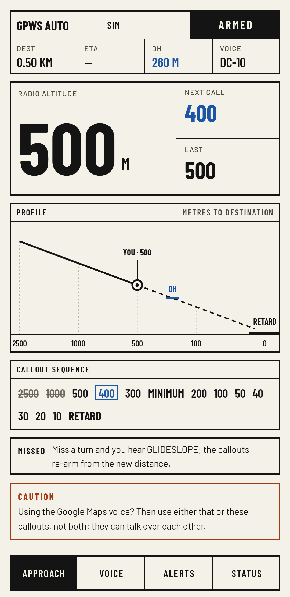
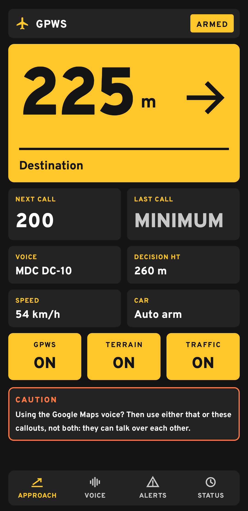

# GPWS Auto

Plane-style landing callouts for your car. GPWS Auto reads your Google Maps navigation and treats
the distance to your destination as radio altitude, so as you arrive you hear
**"2500… 1000… 500… 100… 50, 40, 30, 20, 10… RETARD, RETARD"**, like a real aircraft landing.

<p>
  
  
</p>

Free, no ads, no account, no tracking. Just for fun.

If you enjoy it, you can [buy me a coffee ☕](https://buymeacoffee.com/prat12).

## What it does

**Landing callouts**
- 2500, 1000, 500, 400, 300, 200, 100, 50, 40, 30, 20, 10 metres before your destination
- MINIMUMS at a distance you choose (optional)
- RETARD, RETARD as you stop (A320 style, optional)

**Warnings** (each one can be switched off)

| Callout | When | How the phone knows |
|---|---|---|
| APPROACHING RUNWAY | Just before you join a highway or expressway | Maps' next-turn instruction |
| TERRAIN / DON'T SINK | Slopes over 6% | The air pressure sensor |
| BANK ANGLE | Corners over 0.4 g | The gyroscope, combined with GPS speed |
| SINK RATE / PULL UP | Hard braking | GPS speed dropping fast |
| TOO LOW TERRAIN | Hitting a speed breaker fast | The accelerometer feels the jolt |
| GLIDESLOPE | You miss a turn and Maps reroutes (or RETARD, for fun) | Maps' distance jumps up |
| TRAFFIC, then CLEAR OF CONFLICT | Stuck in a jam, then moving again | GPS speed |
| Overspeed clacker | Above a speed you set | GPS speed |
| Autopilot disconnect | You cancel navigation before arriving | Maps' notification goes away |

**Voices:** Boeing 777, Boeing 737, Airbus A320, MD-11 and DC-10, or "Surprise me" for a
different plane every trip. You can also use your own sounds (any audio or video file, trimmed
in the app) and share them with friends as a sound pack.

**In the car:** it arms itself when you connect to Android Auto or your car's Bluetooth, lowers
your music during callouts, gets louder at speed, and stays quiet during calls.

## Install

Needs Android 8 or newer, and Google Maps.

1. Download the latest `.apk` from [Releases](https://github.com/Prat2412/gpws-auto/releases/latest) and open it. If Android asks,
   allow your browser to install apps.
2. Open **GPWS Auto** and follow the setup checklist:
   - **Notification access**, so it can read Maps' navigation notification. If Android says it's a
     *restricted setting*, go to Settings → Apps → GPWS Auto → ⋮ → **Allow restricted settings**,
     then try again.
   - **Location: Allow all the time.** The speed-based warnings need it, and it makes the final
     callouts land on time.
   - **Battery: Unrestricted**, so Android doesn't stop it mid-drive.
3. Start navigating in Google Maps and drive. To hear a landing without driving, use
   **Status → Simulated approach**.

**Tip:** if you also use the Google Maps voice, the two can talk over each other. Use one or the
other, or mute the Maps voice with the speaker button in Maps.

## Updates

Tap **Status → Updates** to check this page for a newer version. GPWS Auto downloads it and
Android asks you to confirm the install. It only checks when you tap.

If a Google Maps update ever changes its notification so GPWS Auto can't read it, the home
screen says **Can't read Maps**, with a button to check for a fixed version.

## Privacy

GPWS Auto reads Google Maps' navigation notification on your phone, and that's all it reads.
There are no ads, accounts or analytics, and nothing is sent anywhere, except:
- the optional traffic alert, which asks TomTom about the road ahead, only if you add your own
  free TomTom API key;
- update checks to GitHub, only when you tap Check.

## Not a safety system

It's a toy. It plays sounds; it doesn't watch the road. Keep your eyes on the road and drive
the way you would without it.

## Built with AI

I'm not a programmer. The whole app was written by Claude (Anthropic's AI, Opus 5.5) from my
ideas, and I tested it in my car. Bug reports and pull requests are welcome.

## Build it yourself

Install Android Studio (or a JDK 17+ and the Android SDK), then:

```bash
./gradlew assembleDebug
```

The APK lands in `app/build/outputs/apk/debug/`.

## Credits

**Sounds** come from the [FlightGear](https://www.flightgear.org) flight simulator (GPL), trimmed
and level-matched:

| Sounds | Source |
|---|---|
| Boeing 777 numbers, TERRAIN, DON'T SINK, BANK ANGLE, SINK RATE, PULL UP, TOO LOW TERRAIN, autopilot disconnect | fgaddon `Aircraft/777/Sounds` |
| Boeing 737 numbers and minimums | fgaddon `Aircraft/737-800/Sounds/gpws` |
| Airbus A320 numbers, minimums and RETARD | fgaddon `Aircraft/A320-family/Sounds/GPWS` |
| MD-11 and DC-10 | fgaddon `Aircraft/MD-11/Sounds/CAWS`, `Aircraft/DC-10/Sounds/CAWS` |
| V1 | fgaddon `Aircraft/787-8/Sounds` |
| GLIDESLOPE | fgaddon `Aircraft/CRJ700-family/Sounds` chime + fgdata `Sounds/mk-viii` |
| TRAFFIC, CLEAR OF CONFLICT, overspeed | fgdata `Sounds/tcas`, `Sounds/overspeed.wav` |

fgaddon: https://svn.code.sf.net/p/flightgear/fgaddon · fgdata: https://gitlab.com/flightgear/fgdata

APPROACHING RUNWAY and ON RUNWAY have no free real recording, so they were made for this app
with the [Kokoro](https://huggingface.co/hexgrad/Kokoro-82M) text-to-speech model (Apache 2.0,
voice "Emma"), then given the MD-11 voice's pitch, tone and speaker hiss.

**Fonts:** [Barlow](https://github.com/jpt/barlow), [Overpass](https://github.com/RedHatOfficial/Overpass)
and [B612](https://github.com/polarsys/b612), under the SIL Open Font License (texts in
`app/src/main/assets/licenses`).

## License

The code is under the [GNU GPL v3](LICENSE) or later: you can use, change and share it, but
anything you build from it has to stay open source under the same license. The sounds keep their
FlightGear GPL terms.

The name "GPWS Auto" and the app icon aren't covered by the license. If you publish your own
version, please give it a different name and icon.

Not affiliated with Boeing, Airbus, McDonnell Douglas, Honeywell, Google or FlightGear.
